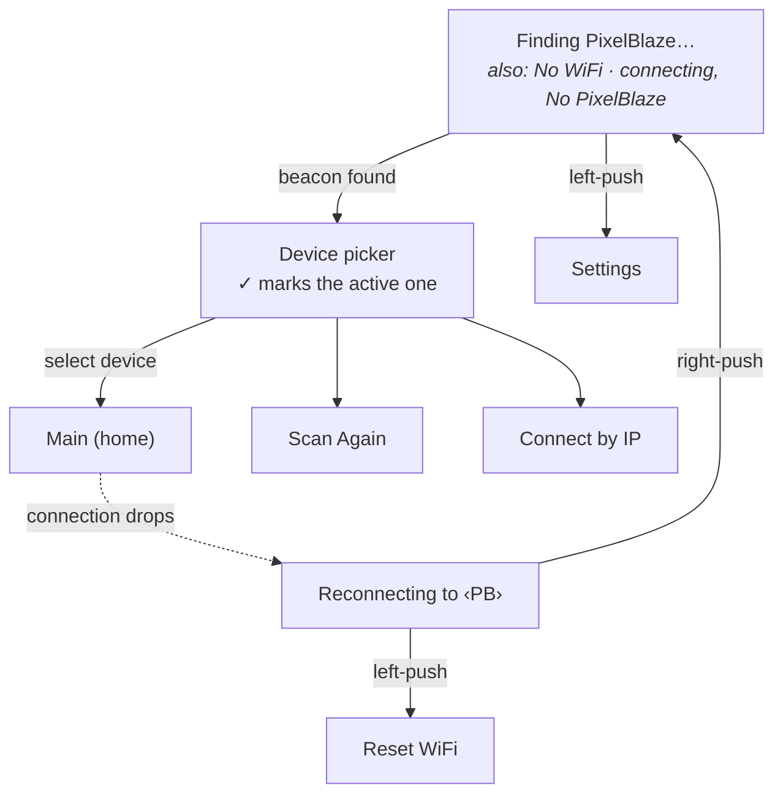

# Menu navigation tree

Every screen on the 128×64 OLED and how you move between them. The whole UI is
one cursored list, driven by two push-rotary knobs. Generated from
[`ui/screens/`](../ui/screens).

## Controls

| Control | Turn | Push |
|---|---|---|
| **Left knob** | move cursor | enter / open » |
| **Right knob** | adjust value ◄► | back |
| **Power button** | *press* → wake | *hold 5s* → shut down |

**Back** (right-push) works on every screen.

## Screen kinds

Referenced in the trees below:

- **Status** — shown automatically, no input
- **List** — a navigable list of rows (`»` = opens a sub-screen)
- **Value** — adjust in place with the right knob (◄►)
- **Action** — fires immediately
- **Text entry** — character picker
- **Confirm / choice** — a yes/no or pick-one modal
- **Power** — shutdown / restart

## Getting connected — driven automatically

Left-push jumps to **Settings** at any time. Once connected, the home screen is
**Main**.

## Main — home screen

Live pattern controls. One row per control the running pattern exposes.

- **Main** — *live pattern controls*
  - **Pattern** *(value)* — right knob cycles patterns
  - **‹ slider control ›** *(value)* — one row per live control
  - **‹ color control ›** `»`
    - **Color editor** *(value)* — R / G / B or H / S / V rows
  - **Settings** `»`
    - *— playback (when connected) —*
      - **Brightness** *(value)* — ◄► 0–100%
      - **Playlist** *(value)* — On / Off
      - **Shuffle** *(value)* — On / Off
    - *— this device —*
      - **Backlight** *(value)* — ◄► 1–9
      - **LED Brightness** *(value)* — ◄► 0–25%
      - **Screen Dim** *(value)* — idle timeout
      - **Screen Off** *(value)* — idle timeout
    - **Device** `»`
      - **Device picker** — switch PixelBlaze · ✓ · Scan Again · Connect by IP
    - **WiFi** `»`
      - **WiFi networks** — pick one · Rescan
        - **Password entry** *(text)* — char picker → `[SEND]`
    - **Info** `»`
      - **Live stats** *(status)* — voltage · charge · uptime · signal · IP · Device FPS · preview rate
    - **Lock** `»`
      - **Locked** — hold both knobs to unlock
    - **Restart** `»`
      - **Restart software** *(action)*
      - **Restart device** *(power)*
      - **Cancel**
    - **Power off** `»`
      - **Cancel**
      - **Yes — shut down** *(power)*

## Overlays — triggered by hardware & idle, not the menu

| Overlay | Trigger | Behavior |
|---|---|---|
| **Dim** | Screen Dim idle timeout | Half brightness; any input wakes it |
| **Sleep** | Screen Off idle timeout | Screen off, polling pauses; "touch any control to wake" |
| **Locked** | Hold both knobs | Locks / unlocks — pocket-proofing |
| **Shutting down** | Hold power button 5s | "Hold to shut down" → clean halt |
